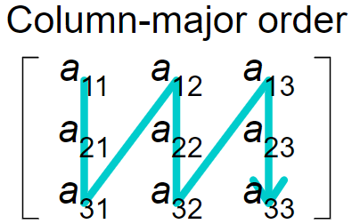

# Chapter 1. Tensor

### Represents one of the outputs of an Operation


##### What is Tensor?

Tensor holds a multi-dimensional array of elements of a single data type which is very similar with `NumPy`'s `ndarray`. When the dimension is zero, it can be called a scalar. When the dimension is 2, it can be called a matrix. When the dimension is greater than 2, it is usually called a tensor. If you are very familiar with `NumPy`, then understanding Tensor will be quite easy.


##### How to create a Tensor?

There are many ways to initialize a Tensor object in TF.NET. It can be initialized from a scalar, string, matrix or tensor. But the best way to create a Tensor is using high level APIs like `tf.constant`, `tf.zeros` and `tf.ones`. We'll talk about constant more detail in next chapter.

```csharp
// Create a tensor holds a scalar value
var t1 = new Tensor(3);

// Init from a string
var t2 = new Tensor("Hello! TensorFlow.NET");

// Tensor holds a ndarray
var nd = new NDArray(new int[]{3, 1, 1, 2});
var t3 = new Tensor(nd);

Console.WriteLine($"t1: {t1}, t2: {t2}, t3: {t3}");
```


##### Data Structure of Tensor

TF uses column major order. If we use NumSharp to generate a 2 x 3 matrix, if we access the data from 0 to 5 in order, we won't get a number of 1-6, but we get the order of 1, 4, 2, 5, 3, 6. a set of numbers.

```csharp
// Generate a matrix:[[1, 2, 3], [4, 5, 6]]
var nd = np.array(1f, 2f, 3f, 4f, 5f, 6f).reshape(2, 3);
// The index will be   0  2  4    1  3  5, it's column-major order.
```





##### Index/ Slice of Tensor

Tensor element can be accessed by `index` and `slice` related operations. Through some high level APIs, we can easily access specific dimension's data.

